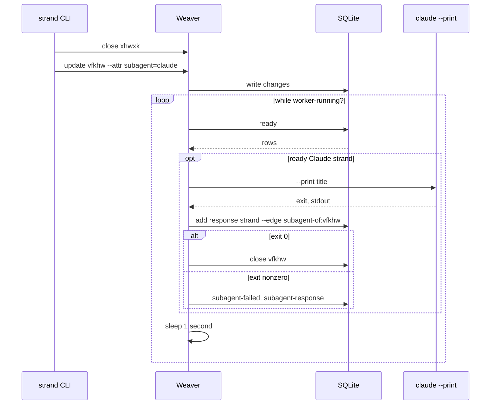

# Millstrand

Millstrand is a local runtime agents coordinate through: a graph of strands, SQLite in a long-lived weaver, and a thin CLI in front.

Docs: [codethread.github.io/millstrand](https://codethread.github.io/millstrand/).

> millstrand naming leans heavily on a textile metaphor
>
> - strand: the unit of storage
> - weaver: the runtime that processes strands
> - mill: think textile mill, the place managing all the weavers

## TOC

<!-- vim-markdown-toc GitLab -->

- [Why](#why)
- [About](#about)
    - [A graph](#a-graph)
    - [The weaver](#the-weaver)
    - [Named queries](#named-queries)
    - [Going further](#going-further)
- [See it in action](#see-it-in-action)
    - [Install](#install)
    - [Run](#run)
- [Why Clojure](#why-clojure)

<!-- vim-markdown-toc -->

## Why

Unlike most tools out there, millstrand does not claim to know how to solve **your** agentic problems; instead it tries to give you the tools to build out your stack. It is deeply inspired by tools like [Emacs](https://www.gnu.org/software/emacs/) and [pi](https://github.com/earendil-works/pi), and tries to capture what those tools might embody as an orchestration layer. It is also inspired in spirit by [beads](https://github.com/steveyegge/beads), [Claude workflows](https://code.claude.com/docs/en/workflows) and [Temporal](https://temporal.io/), but as you'll see, it's quite different in practice.

Load-bearing behaviour is Clojure you can read, diff, and test — not an instruction file every agent has to remember. Coordination lives above the harness: Claude and GPT can share one graph; swapping providers does not mean rebuilding the process.

It is local. There is no hosted service, web UI, or accounts. You need Go, a JVM, and Clojure on the machine. It is also alpha: APIs and contracts can still change.

The runtime is written for agents, so while we show commands here, the intent is for agents to use, explain and extend the system on your behalf. The system has introspection built into its core.

## About

Millstrand lets you create durable items called `strands`. At first, they may seem too simple:

```json
{ "id": "…", "title": "…", "state": "active|closed|replaced", "attributes": {} }
```

You (but more typically, your agents) manipulate these with the `strand` cli:

```sh
strand add "Sketch the data model" --attr type=docs
# Output abbreviated:
# {
#   "id": "xhwxk", "title": "Sketch the data model",
#   "state": "active", "attributes": { "type": "docs" },
#   "created_at": "…", "updated_at": "…"
# }
```

### A graph

As you add more with edge relationships, you begin to form a graph:

> `depends-on` is acyclic: the engine rejects a cycle in that relation.

```sh

strand add "Write the docs" --attr type=docs --edge depends-on:xhwxk  # gbkcx
strand add "Build the CLI"  --attr type=code --edge depends-on:xhwxk  # vfkhw
strand add "Announce the release" --edge depends-on:gbkcx --edge depends-on:vfkhw
```


```sh
strand list
# Output abbreviated; rows are ordered by id.
# [
#   {"id":"gbkcx","title":"Write the docs","state":"active","attributes":{"type":"docs"},"created_at":"…","updated_at":"…"},
#   {"id":"st1ca","title":"Announce the release","state":"active","attributes":{},"created_at":"…","updated_at":"…"},
#   {"id":"vfkhw","title":"Build the CLI","state":"active","attributes":{"type":"code"},"created_at":"…","updated_at":"…"},
#   {"id":"xhwxk","title":"Sketch the data model","state":"active","attributes":{"type":"docs"},"created_at":"…","updated_at":"…"}
# ]

strand ready
# Output abbreviated:
# [{"id":"xhwxk","title":"Sketch the data model","state":"active","attributes":{"type":"docs"},"created_at":"…","updated_at":"…"}]
```

### The weaver

That graph is a to-do list. Close the strand blocking "Build the CLI", then add a custom attribute — `subagent` is a meaning we invented, not a Millstrand concept:

```sh
strand update xhwxk --state closed
strand update vfkhw --attr subagent=claude
```

The **weaver** is a running [Clojure](#why-clojure) process that owns the same rows. Write code it will run to respond to that attribute. The stdout lives on its own strand, linked with `subagent-of` — another name we invented, not `depends-on`, so it does not change what is ready:

```clojure
(require '[clojure.java.shell :as shell]
         '[millstrand.api.current.alpha :as current]
         '[millstrand.api.weaver.alpha :as weaver])

(def rt (current/runtime))
(def worker-running? (atom true))

(def worker
  (future
    (while @worker-running?
      (doseq [{:keys [id title attributes]} (weaver/ready rt)
              :when (and (= "claude" (:subagent attributes))
                         (not (:subagent-failed attributes)))]
        (let [{:keys [exit out]} (shell/sh "claude" "--print" title)]
          (weaver/add! rt {:title "claude stdout"
                           :attributes {:stdout out}
                           :edges [{:type "subagent-of" :to id}]})
          (if (zero? exit)
            (weaver/update! rt id {:state "closed"})
            (weaver/update! rt id {:attributes {:subagent-failed true
                                                :subagent-response out}}))))
      (Thread/sleep 1000))))
```

<details markdown>
<summary>Reading the Clojure</summary>

`future` starts the worker without blocking the REPL. `while` polls until `worker-running?` becomes false. `(doseq …)` walks each ready strand, and the `:when` clause selects Claude work that has not already failed. `{:keys [id title attributes]}` pulls those fields out of the row. `:subagent` is the keyword form of the `subagent=claude` the CLI just wrote.

`(shell/sh "claude" "--print" title)` is an ordinary process; `exit` and `out` are its status and stdout. `weaver/add!` and `weaver/update!` are `strand add` / `strand update`, called from inside the weaver. `:edges [{:type "subagent-of" :to id}]` is `--edge subagent-of:<id>` on the new strand. The `!` is a convention for "this changes something", not syntax.

Stop and join the worker when you are finished:

```clojure
(reset! worker-running? false)
@worker
```

The [Clojure crash course](./docs/clojure-crash-course.md) covers the rest.

</details>



### Named queries

So now a strand can finish without anyone at the keyboard. Failures are just more attributes on the same rows (`subagent-failed`, `subagent-response`). You could `strand list` and filter with jq every time — clunky, and every agent has to remember the shape.

Register a live named query instead. The query is a small data expression, not SQL. For a durable query, use `defquery!` in a module source.

```clojure
(require '[millstrand.api.graph.alpha :as graph])

(graph/register-query! rt 'failed-runs
  [:= [:attr :subagent-failed] true])
```

The weaver is live, so the CLI can use that name immediately. No restart, no rebuild:

```sh
strand list --query failed-runs
# Output abbreviated:
# [{"id":"vfkhw","title":"Build the CLI","state":"active",
#   "attributes":{"type":"code","subagent":"claude","subagent-failed":true,"subagent-response":"…"},
#   "created_at":"…","updated_at":"…"}]
```

### Going further

That is a taste of the surface. You could grow the sketch into its own command with [`defop`](./docs/spools/customisation.md#your-own-cli-command) — a `strand agent run` of your own — or a Go TUI of active and idle subagents with [`defbin`](./docs/api/millstrand.api.md#millstrand.api.millstrand.alpha/defbin!).

If that sounds like a lot, you do not have to start from zero. Extensions are [spools](./spools/README.md): ordinary Clojure, made to be pinned, inspected, and loaded in another weaver. A workflow engine, a kanban board, and delegated agent runs already exist as [external spools](./spools/README.md). [Writing shared spools](./docs/spools/writing-shared-spools.md) is the contract if you want to publish your own.

Next: [install](#install) and experiment, or follow the [tutorial](./docs/tutorial.md).

## See it in action

### Install

<details markdown>
<summary>macOS with Homebrew</summary>

```sh
brew tap codethread/millstrand https://github.com/codethread/millstrand.git
brew trust --formula codethread/millstrand/millstrand
brew install millstrand
```

Homebrew requires explicit trust for non-official taps. This trusts only the Millstrand formula, not every current or future item in the tap. Homebrew installs Clojure and its JVM dependency.

</details>

**OR**

<details markdown>
<summary>Build from source</summary>

Needs Go, Clojure, and a JVM. From a cloned Millstrand checkout:

```sh
make install
```

</details>

### Run

`mill` is a supervisor you start once. It routes to a **weaver** per workspace — the Clojure process that owns that repo's strands.


1. Open a dedicated terminal tab and run:
    ```sh
    mill start # Starts a long lived process, so leave this running
    ```
2. In a new terminal tab:
    ```sh
    mkdir ~/learn-millstrand
    cd ~/learn-millstrand
    git init
    mill init
    mill weaver start
    strand help
    ```
3. Spawn your favourite agent and have **it** explain millstrand
4. Check the [docs](https://codethread.github.io/millstrand/)

## Why Clojure

Clojure is an unusual choice in a modern agent stack. The weaver is a live Lisp image: a process you attach to, not a binary you restart to change behaviour.

```sh
mill weaver repl
```

Any agent — or human — in that REPL sees the same strands, registries, and in-memory state, and can inspect or change them while the weaver keeps running:

```clojure
(require '[clojure.repl :refer [apropos dir doc source]]
         '[millstrand.api.current.alpha :as current]
         '[millstrand.api.runtime.alpha :as runtime]
         '[millstrand.api.weaver.alpha :as weaver])

(def rt (current/runtime))

(weaver/ready rt)
;; => [{:id "xhwxk", :title "Sketch the data model", :state "active", ...}]

(weaver/update! rt "xhwxk" {:state "closed"})
;; => {:id "xhwxk", :title "Sketch the data model", :state "closed", ...}

(runtime/refresh! rt)
;; => {:status :unchanged, :mode :full, ...}
```

`ready` is a read. `update!` is a write. `refresh!` reloads user config and module source into the running weaver without dropping the graph. It reports `:applied` when it changes the running image and `:unchanged` when the declared world is already active.

The same REPL can ask the language about itself — every namespace, function, and docstring in the running image:

```clojure
(dir weaver)
;; => acyclic-relations
;;    add!
;;    ...
;;    update!

(doc weaver/ready)
;; => -------------------------
;;    millstrand.api.weaver.alpha/ready
;;    ([runtime] [runtime query-def params])
;;      Return ready strands for `runtime`, optionally filtered by a query definition.

(source weaver/add!)
;; => (defn add!
;;      "Create a strand, enqueue a creation event, and return the normalized strand.
;;
;;        The transaction normalizes attributes through the `:attributes/normalize`
;;        transform hooks, inserts the strand, applies its edges, ..."
;;      ([runtime strand]
;;       (add! runtime strand (request-context :add)))
;;      ...)

(apropos "refresh")
;; => (millstrand.api.runtime.alpha/refresh!
;;     millstrand.core.weaver.lifecycle-effects/refresh
;;     millstrand.core.weaver.runtime/refresh-modules!)
```

`dir` lists a namespace. `doc` prints a docstring. `source` shows the function. `apropos` finds names. An agent can discover the surface from inside the process, not only from files on disk.

The [Clojure crash course](./docs/clojure-crash-course.md) is enough to read the snippets on this page.
