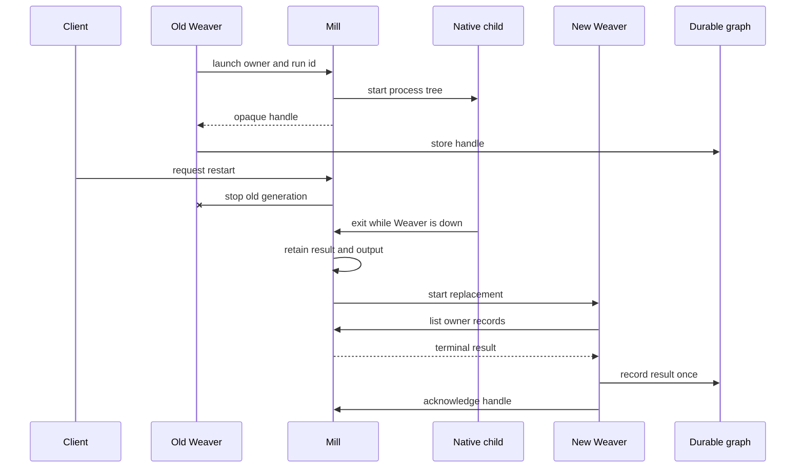

# Weaver restart continuity proposal

- **Document ID:** `PROP-Wrc-001`
- **Status:** Approved
- **Approved: 2026-09-23
- **Approved:** —
- **Related RFCs:** None
- **Related root specs:** [CLI](../../specs/cli.md) (SPEC-002), [REPL API](../../specs/repl-api.md) (SPEC-003), [Weaver runtime](../../specs/daemon-runtime.md) (SPEC-004)

Once approved this document is frozen. Later detail belongs in spec deltas, the plan, and code.

## PROP-Wrc-001.P1 Problem

Mill supervises Weaver processes, but replacement is not a first-class transition. Durable records survive while a native child, waiter, or client call can die with the old JVM. Restart can therefore kill useful work or strand a durable record. That cost has also encouraged unrelated machinery, including live classpath mutation, whose main purpose is avoiding restart.

Mill is the local Go supervisor. A Weaver is the Clojure process serving one selected workspace, and each replacement process is a new generation. A spool is Clojure code loaded into a Weaver. A native process is an operating-system child such as an agent harness; its waiter is the Weaver thread blocked until it exits. Restart state is visible through `mill weaver status`, lifecycle command results, and Mill-routed client errors.

Current consumers fail differently. Legacy `agent-run` kills a verified orphan and retries. Newer `harness-core`/`agent-cli` has no equivalent reconciliation and can leave a durable run in its running phase. Millhouse shell execution can lose its waiter. Ralph is external but treats a failed board call as terminal. In-JVM callbacks cannot transfer at all.

## PROP-Wrc-001.P2 Goals

### PROP-Wrc-001.G1 — Atomic replacement

Mill owns one declared restart transition per selected workspace. Concurrent start and restart calls converge on one replacement generation.

### PROP-Wrc-001.G2 — Readiness-aware clients

Mill-routed clients can wait through planned downtime before sending an operation. Accepted operations are never replayed.

### PROP-Wrc-001.G3 — Native-process continuity

Selected long-running native processes continue while their Weaver is replaced. Mill retains their output and completion facts until the replacement Weaver reconciles them.

### PROP-Wrc-001.G4 — Domain policy stays with the owner

Mill reports process facts. Agent, shell, and other spool code decides how those facts update durable domain state.

### PROP-Wrc-001.G5 — Explicit interruption

Every relevant in-JVM and connection-bound surface states whether restart interrupts, rearms, retries, or reconciles it.

## PROP-Wrc-001.P3 Non-goals

### PROP-Wrc-001.NG1 — No transparent request replay

Mill does not queue and replay accepted mutation envelopes across generations.

### PROP-Wrc-001.NG2 — No universal subprocess migration

Short synchronous helpers remain ordinary Weaver children unless their owning contract requires them to continue across Weaver restart.

### PROP-Wrc-001.NG3 — No JVM computation transfer

Clojure closures, active callbacks, and live connections do not move between JVMs.

### PROP-Wrc-001.NG4 — No exactly-once external effects

Spools still own idempotency, checkpoints, and ambiguity at their effect boundaries.

### PROP-Wrc-001.NG5 — No cross-Mill survival

The first process-custody contract survives Weaver replacement while Mill remains alive. It is not a persistent system service.

## PROP-Wrc-001.P3a Robustness posture

This proposal optimizes the ordinary planned replacement: Mill stays alive, one Weaver stops, and a valid replacement starts. That path covers the common "turn it off and on again" case and preserves substantially more useful work than today.

Millstrand promises resumability, not replayability or reconstruction of every interrupted action. Likely boundary failures with durable consequences receive explicit recovery: Mill retains native children and completion facts, clients wait before first send, and spool reconciliation is idempotent. Unlikely local races fail loudly or return `weaver/restarted`; the agent or user inspects current durable state and continues. The design does not add journals, callback replay, speculative rollback, or guards for every crash point.

Reconciliation stays narrow. Mill reports process facts, while each spool translates those facts into its existing durable state machine. A missing record, mismatched handle, or conflicting attempt is visible and requires intervention rather than guessed repair.

## PROP-Wrc-001.P4 Proposed scope

### PROP-Wrc-001.S1 — Restart state machine

`mill weaver restart --workspace <selected-workspace>` first records `probing` while the old generation remains running and admitted. A successful probe atomically closes old-generation admission and moves the transition to `restarting`; Mill then asks the old Weaver to stop, launches exactly one replacement, and waits for the same ready metadata as ordinary startup. Ready means the request socket is accepting calls, `init.clj` and optional `init.local.clj` have loaded, module and lifecycle reconciliation has completed, and persistent scheduler rows have rearmed. Mill then records `running`. A failed probe returns the workspace to `running` with probe diagnostics and no cutover.

If the old Weaver misses its stop grace period, Mill terminates it and continues. If termination cannot be confirmed, restart records `failed` and does not launch a replacement. If replacement launch, transport readiness, configuration activation, or scheduler rearm fails, restart records `failed` with stage, logs, and exit evidence. Once `restarting` is visible, the old generation never returns to service. A later restart may recover from `failed`. `probing`, `restarting`, `running`, and `failed` are observable through lifecycle status and command results.

Before stopping the old generation, restart runs a fresh-generation replacement probe. Mill constructs a disposable workspace from the selected workspace's effective config while retaining the original repository and config roots as source-resolution authorities. The probe has fresh storage, runtime state, and a fresh JVM classloader. It runs real root materialization and dependency resolution, then reuses the existing dry-run refresh coordinator to collect the layered module graph and every selected `use-*!` and `def-*!` authoring declaration, stage complete candidate registries, run candidate validation, resolve lifecycle callables, and produce a lifecycle plan.

The probe does not publish candidate registries, open lifecycle resources, invoke seed or reconcile effects, rearm scheduler rows, deliver events, launch custodied processes, or publish canonical Weaver metadata. Authoring declarations may not depend on a published registry, active lifecycle handle, ambient request, or prior generation. Dispatch-time and lifecycle binding still happens at its declared boundary. Probe mode does not sandbox arbitrary top-level Clojure evaluation; trusted source that performs work merely by loading remains responsible for those effects.

The probe writes structured diagnostics incrementally, including root and module outcomes, the complete effective candidate-registry projection with ownership, its diff from the old generation's effective projection, the unexecuted lifecycle plan, completed and skipped stages, failure context, and logs. A successful probe is stopped and removed before cutover. A failed probe is stopped but retained for inspection; restart returns its path and diagnostics while the old Weaver remains in service and the transition returns from `probing` to `running` without entering `restarting`.

The probe catches config, dependency, fresh-classpath, source-loading, authoring, candidate-registry, and lifecycle-structure failures. It may warm existing content-addressed Git and Maven caches, but restart promises no speedup. It cannot prove that lifecycle activation or reconciliation against the selected workspace's durable state will succeed. Once the probe passes, replacement startup remains authoritative and fails loudly with stage and logs.

### PROP-Wrc-001.S2 — Convergence and admission

Start during `running` or `probing` returns the admitted old generation. Restart during `running` creates one transition; restart during `probing` or `restarting` joins it. Start during `restarting` joins the replacement transition. Each joining lifecycle caller uses the existing Weaver readiness timeout, independently measured from when it joined, and receives the terminal generation or failure if the transition finishes in that period. Caller timeout or cancellation does not cancel the shared transition.

Mill owns one admission gate per selected workspace, shared by invocation forwarding and lifecycle transitions. Before its first Weaver socket write, an invocation atomically binds to the current running generation or waits. Restart atomically closes admission to the old generation before recording `restarting`; no later invocation can bind to it. Admission to a generation is the request boundary: once Mill performs the first write, that request is sent and will never be replayed.

### PROP-Wrc-001.S3 — Wait before send

The `strand` CLI and other clients that send through Mill are Mill-routed. A request that has not gained admission waits while restart is in progress; each waiting handler may block on the shared transition rather than entering a persisted queue. If the replacement becomes ready within the request's existing deadline, the request binds to it and is sent once. Replacement failure returns the shared restart failure and diagnostics without sending the request. Deadline expiry or client cancellation returns the existing result for that condition without sending it.

A request admitted to the old generation before restart won the race. Mill never replays it, and it may return `weaver/restarted` if cutover interrupts the connection. Results therefore distinguish work known not to have been sent from work sent once with an ambiguous interrupted result. Clients connected straight to the Weaver request socket or its network REPL see an ordinary disconnect and reconnect themselves.

### PROP-Wrc-001.S4 — Native-process custody

The spool-facing surface is a blessed Clojure namespace, provisionally `millstrand.api.process.alpha`, backed by the Weaver-to-Mill control channel. It is available only to trusted in-process code and takes the active runtime explicitly. Process custody is not exposed as a `strand` op or a general public socket command.

The API has five operations:

```clojure
(process/launch! runtime owner key launch-spec)
(process/get runtime handle)
(process/list-owned runtime owner)
(process/cancel! runtime handle)
(process/acknowledge! runtime handle)
```

`owner` is a stable spool-owned keyword. `key` is an owner-scoped idempotency key derived from the durable domain record, such as `"run-42"`; callers do not use a PID as either value. `launch-spec` is data, not a shell command string. It contains an argv vector, working directory, environment additions, and optional stdin content. Mill validates the complete spec before launch.

```clojure
(process/launch!
 runtime
 :agent-harness/run
 "run-42"
 {:argv ["claude" "--print"]
  :cwd "/workspace/repo"
  :env {"NO_COLOR" "1"}
  :stdin prompt})
```

`launch!` atomically reserves `[owner key]` and returns a process record. The first call starts one process tree. A repeated call with the same launch spec returns the existing record, whether it is starting, running, or terminal. Reuse with a different spec fails loudly. The reservation remains after acknowledgement, so the key can never launch a second child during the selected workspace's lifetime.

The returned record has an opaque `:handle`, the caller's `:owner` and `:key`, a `:phase` of `:starting`, `:running`, or `:terminal`, and output references. A terminal record also has the exit status or Mill cancellation reason. Mill may report diagnostic process identity, but callers must store and address the opaque handle rather than a PID.

`get` returns the current record for one handle. `list-owned` returns every unacknowledged `:starting`, `:running`, or `:terminal` record for an owner and is the startup reconciliation surface. Mill alone resolves `:starting` to `:running` or a terminal launch failure; spools inspect it again rather than reconstructing a partial launch. Unknown handles and owner mismatches fail loudly. `cancel!` requests cancellation of the whole process tree and is idempotent; completion remains observable as a terminal record. `acknowledge!` accepts only a terminal handle, removes it from `list-owned`, and permits output cleanup. It does not remove the idempotency reservation.

Mill owns PID-reuse-safe identity, process-tree cancellation, and durable stdout and stderr files. Spool code owns the mapping from its durable record to the handle and the domain update applied during reconciliation.

### PROP-Wrc-001.S5 — Completion retention

An exit fact remains available until its owning spool acknowledges it. Acknowledgement removes the fact from enumeration and permits log cleanup, but retains the small key-to-handle tombstone that prevents relaunch. Restart does not depend on an in-memory callback. Reconciliation may observe the same unacknowledged fact more than once, so applying it to domain state must be idempotent.

### PROP-Wrc-001.S5a — Owner reconciliation

A migrated spool declares process reconciliation through its existing module-owned `defreconcile!` lifecycle effect; this proposal adds no second reconciliation registry. During replacement activation, the effect compares the owner's durable active records with `list-owned` facts after its module source and required durable state are available. A matching `:starting` or `:running` process preserves the domain claim and schedules a later check. A matching terminal process applies its result idempotently, advances the owning state machine, then acknowledges the handle.

Failure to reach Mill's custody service or enumerate an owner means continuity cannot be assessed and fails replacement startup visibly. Individual missing records, mismatched handles, and owner or attempt conflicts are owner-local reconciliation failures: the effect records and reports them without guessing repair or preventing unrelated modules from becoming ready. Healthy records continue. The agent or user inspects the current durable state and resumes the affected run or gate.

### PROP-Wrc-001.S6 — Mill lifetime

Clean Mill shutdown terminates owned process trees and records terminal cancellation when its store remains available. Abrupt Mill death, orphan adoption, and continuity across a new Mill process are outside this proposal.

### PROP-Wrc-001.S7 — Consumer migration

Legacy `agent-run` and newer `harness-core`/`agent-cli` converge on one custody-backed headless path before release. Millhouse shell execution adopts the same primitive. Existing interactive backends keep their separate lifecycle contract. Ralph waits before new calls; if an accepted read returns `weaver/restarted`, Ralph waits for readiness and explicitly reissues only that safe read. It does not reissue mutations automatically.

### PROP-Wrc-001.S8 — In-JVM outcomes

The restart outcomes are:

| Surface | Owner | Observable restart result |
| --- | --- | --- |
| Code executor callback | Millhouse spool | Returns or records interruption; Millhouse clears the running claim and marks the gate retryable rather than assuming the callback completed. |
| Scheduler handler already running | Owning spool | Interrupted; the durable schedule rearms under the existing at-least-once contract, so the invocation may run again. The handler must tolerate that ambiguity. |
| Event-lane or chime delivery in flight | Publishing spool | Interrupted and not replayed. Producers that require delivery persist their own outbox and republish after startup. |
| Peer call | Calling Weaver code | Completes before shutdown or returns `weaver/restarted`; never replayed by Mill. |
| Connected REPL | User/client | Socket closes; reconnect to the replacement. |
| Mill-routed stream or await | Client operation | Accepted work is interrupted with `weaver/restarted`; a not-yet-sent request follows S3. |

Persistent scheduler rows and graph records reconstruct on startup. An owner may define a stronger durable reconciliation contract in its own spec.

### PROP-Wrc-001.S9 — Acceptance coverage

End-to-end tests prove the ordinary replacement path: the probe leaves the old generation serving, rejects invalid dependencies or candidate registries with retained diagnostics, and permits a valid fresh-generation plan; generation identity then changes once, concurrent callers converge, admitted and waiting requests respect the one-send boundary, replacement startup failure is visible, caller timeout does not cancel shared restart, native work survives replacement, and terminal work reconciles. Focused contract tests cover all unacknowledged process phases, agent delegation, Millhouse shell-gate completion, owner-local reconciliation conflicts, safe read reissue, scheduler rearm, accepted await interruption, and clean Mill shutdown cancellation. Other S8 outcomes need explicit contracts, not an exhaustive test matrix over unlikely crash timing.

## PROP-Wrc-001.P5 Worked replacement probe

A dependency edit records a pending generation. `mill weaver restart` creates a disposable world, starts a fresh JVM in probe mode, acquires the edited roots, and drives the existing refresh coordinator through candidate validation. The old Weaver continues serving throughout.

```clojure
{:success false
 :stage :module/evaluate
 :probe/workspace "/tmp/millstrand-restart-probe-abc"
 :source/workspace "/repo/.millstrand"
 :completed [:config/read :spools/materialize :maven/resolve :module/graph]
 :failed {:module :ct/workflows
          :source ".millstrand/ct/workflows/config.clj"
          :exception "Could not locate foo/bar.clj"}
 :skipped [{:stage :publication :reason :probe-mode}
           {:stage :lifecycle/apply :reason :probe-mode}
           {:stage :scheduler/rearm :reason :probe-mode}]
 :log "/tmp/millstrand-restart-probe-abc/weaver.log"}
```

This failure stops and retains the probe, returns its diagnostics, and leaves the old generation running. A successful result includes the complete candidate registry and lifecycle plan; Mill stops and removes the probe, closes old-generation admission, and begins the real cutover. The replacement evaluates its own source rather than reusing executable probe state.

## PROP-Wrc-001.P6 Worked agent delegation

Agent A has spawned agent B. Both are Mill-owned processes with durable run records. B later invokes `strand agent delegate` to spawn C while restart is already visible. Mill holds that not-yet-sent request. The replacement Weaver activates the agent spool, reconciles A and B as still running, and becomes ready. Mill then sends B's request once; the spool creates C's durable run and launches C normally. A, B, and C remain the workflow's state machines.

If the old Weaver accepted B's delegation before cutover but its response was lost, Mill returns `weaver/restarted` and does not replay it. B inspects durable delegation state and retries only if C does not exist. A stable delegation key makes that retry converge on the existing C run.

This schematic agent-spool code launches from a durable run id and stores Mill's handle:

```clojure
(let [process (process/launch!
               runtime
               :agent-harness/run
               run-id
               {:argv ["claude" "--print"]
                :cwd checkout
                :stdin prompt})]
  (runs/record-process! runtime run-id (:handle process)))
```

On module activation, the agent module's `defreconcile!` effect enumerates the owner's records. Terminal children are applied idempotently before acknowledgement. Starting and running children need no relaunch; the spool retains their handle and schedules another reconciliation check.

```clojure
(doseq [{:keys [handle key phase exit output]} (process/list-owned runtime :agent-harness/run)]
  (case phase
    :starting
    (reconcile-later! runtime handle)

    :running
    (reconcile-later! runtime handle)

    :terminal
    (do
      (runs/record-result-once! runtime key {:exit exit :output output})
      (process/acknowledge! runtime handle))

    nil))
```

If the Weaver exits after `record-result-once!` but before acknowledgement, the next generation sees the same terminal record. The domain write changes nothing on its second application, then acknowledgement succeeds.



## PROP-Wrc-001.P7 Worked Millhouse shell gate

Millhouse records a durable gate attempt before launching its shell executor. The attempt id is also the process key, closing the useful part of the launch-to-record crash window:

```clojure
(let [attempt (shell-attempts/claim! runtime gate-id)
      process (process/launch!
               runtime
               :millhouse/shell-executor
               (:id attempt)
               {:argv ["make" "quality"]
                :cwd checkout})]
  (shell-attempts/record-handle! runtime (:id attempt) (:handle process)))
```

After replacement, Millhouse's `defreconcile!` effect enumerates its processes. A starting or running process keeps its gate claimed. A terminal process is applied only when its attempt is still current; Millhouse records the result, advances or fails the gate through ordinary workflow policy, then acknowledges the handle. Stale attempts become visible owner-local failures rather than advancing a different gate attempt.

```clojure
(doseq [{:keys [key handle phase exit output]}
        (process/list-owned runtime :millhouse/shell-executor)]
  (case phase
    :starting (reconcile-later! runtime handle)
    :running (reconcile-later! runtime handle)
    :terminal (do
                (shell-attempts/record-result-once!
                 runtime key {:exit exit :output output})
                (workflow/apply-shell-result-once! runtime key)
                (process/acknowledge! runtime handle))))
```

A workflow await that reaches Mill during planned downtime waits and is sent once to the replacement. An await already accepted by the old Weaver ends with `weaver/restarted`; a workflow-aware client rearms it against the same durable run id. If reconciliation advanced the gate during downtime, the new await immediately returns the new frontier. Mill does not replay the accepted await because only the workflow client knows that rearming this read is safe.

## PROP-Wrc-001.P8 Why custody belongs in Mill

Spool-owned children leave the waiter and process pipes inside the generation being replaced. Detaching only during orderly shutdown misses Weaver crashes and cannot transfer Java `Process` wait state. Requiring every spool to build an external supervisor duplicates process identity, output, cancellation, and retention policy. Tmux works for interactive sessions but is not a suitable protocol or dependency for every headless child. Mill already owns Weaver lifecycle and remains alive across the target failure boundary, so it is the narrow common custodian. This adds process-supervisor and retained-fact duties to Mill; the scope limits that cost to explicitly registered native work.

## PROP-Wrc-001.P9 Evidence

Mill's current serial start idempotence and ordinary lifecycle behavior are implemented in [`startWeaver`](https://github.com/codethread/millstrand/blob/8142fded78030327d5b48dd02c2043f660af0e64/cli/cmd/mill/lifecycle.go#L99-L190) and covered by [lifecycle tests](https://github.com/codethread/millstrand/blob/8142fded78030327d5b48dd02c2043f660af0e64/cli/cmd/mill/lifecycle_test.go). A sibling start may currently receive `starting`; concurrent callers do not yet join one terminal transition.

These sources demonstrate the current failure modes. [`reconcile!`](https://github.com/codethread/agent-harness.spool/blob/ded2f8ae3efa572ff2bd642453dcc5a02d3c2392/agent-run/src/ct/spools/agent_run.clj#L2323-L2362) destroys and resets legacy headless orphans. [`process-result`](https://github.com/codethread/agent-harness.spool/blob/ded2f8ae3efa572ff2bd642453dcc5a02d3c2392/agent-cli/src/ct/spools/agent_cli.clj#L169-L181) starts and waits for the newer child inside the Weaver. Millhouse [`execute!` and `run-gate!`](https://github.com/codethread/millhouse.spool/blob/3c5116ed16439ebd2233e6bf699dc6b7080eb722/spools/shell-executor/src/millhouse/spools/executors/shell.clj#L224-L303) join the process wait to its gate update in one Weaver-owned call. Ralph's [gate read](https://github.com/codethread/codethread.spool/blob/b83b9adb9b75665ea968cf3a4500cacfabf010fd/spools/ralph/internal/loop/loop.go#L284-L290) turns an ordinary board error into a terminal loop error.

## PROP-Wrc-001.P10 Open questions

None at proposal scope. Follow-on specs must name exact wire encodings, process-record storage schema, operating-system process-tree mechanics, and log-retention periods without changing the operations or outcomes above.
