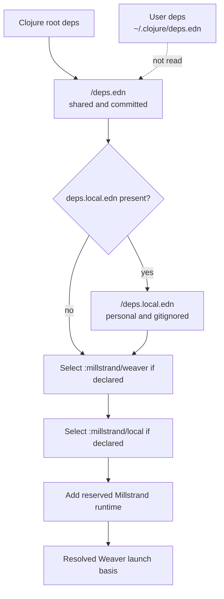
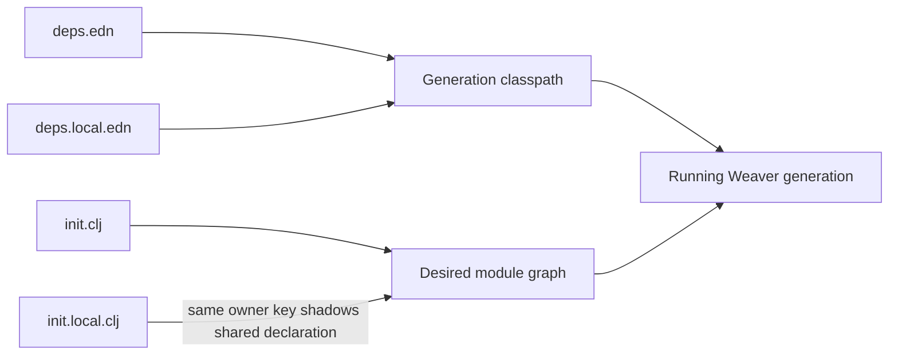

# Deps-native spool dependencies proposal

**Document ID:** `PROP-Dns-001`
**Status:** Approved
**Approved:** 2026-08-29
**Depends on:** [`PROP-Wrc-001`, Weaver restart continuity](../weaver-restart-continuity/proposal.md)
**Related RFCs:** [Spool authoring forms](../../rfcs/2026-07-28-spool-authoring-forms.md), [Lifecycle authoring forms](../../rfcs/2026-07-28-lifecycle-authoring-forms.md), [Runtime module `:using`](../../rfcs/2026-08-14-runtime-module-using.md)
**Related root specs:** [CLI](../../specs/cli.md) (SPEC-002), [REPL API](../../specs/repl-api.md) (SPEC-003), [Weaver runtime](../../specs/daemon-runtime.md) (SPEC-004), [Alpha surface](../../specs/alpha-surface.md) (SPEC-005), [Testing](../../specs/testing.md) (SPEC-006)

Once approved this document is frozen. Later detail belongs in spec deltas, the plan, and code.

## PROP-Dns-001.P1 Problem

Millstrand has two dependency descriptions. Standard `deps.edn` files drive Clojure tooling and tests, while `spools.edn` drives Weaver acquisition, approval, root ownership, compatibility floors, Maven resolution, and live classpath mutation. Consumers must keep overlapping Git SHAs and roots aligned, while Millstrand maintains a separate package-management subsystem alongside tools.deps.

A Weaver is the Clojure process serving one selected workspace. A spool is a Clojure library loaded into that process. Mill is the local Go supervisor and CLI that starts and replaces Weavers. tools.deps is Clojure's standard dependency resolver; its basis is the resolved libraries and classpath for one Weaver generation. By default, Mill discovers the nearest `.millstrand` or `.ms` workspace directory; `--workspace` selects one explicitly.

The separate dependency subsystem exists mainly so a running Weaver can add libraries without restarting. Replacement and removal already need a fresh generation because the JVM cannot safely unload an active classpath. Once Weaver replacement is supervised and readiness-aware, live coordinate mutation no longer justifies a second dependency language.

Replacement still disconnects REPLs and interrupts uncheckpointed JVM callbacks while the new Weaver starts. A failed replacement leaves the workspace in the predecessor proposal's visible `failed` state until the user fixes the cause and retries. [`PROP-Wrc-001`](../weaver-restart-continuity/proposal.md) preserves registered native work and exposes replacement readiness and failure to callers without replaying accepted mutations. That limits the accepted disruption to disconnected REPLs and uncheckpointed JVM callbacks. This proposal accepts that interruption in exchange for removing live coordinate mutation and its second package-management model.

## PROP-Dns-001.P2 Goals

### PROP-Dns-001.G1 — One dependency language

Use ordinary tools.deps data as the only coordinate language for shared and personal code available to a Weaver generation.

### PROP-Dns-001.G2 — Live activation and authoring

Keep `init.clj`, `init.local.clj`, workspace-relative `:file` modules, owner-complete authoring forms, lifecycle reconciliation, and `runtime/refresh!` as the live configuration path. A developer can add a personal spool dependency and activate its modules without changing the team's committed configuration.

### PROP-Dns-001.G3 — Fresh generations for coordinate changes

Every added, removed, or changed Git, local, or Maven coordinate takes effect in a newly launched Weaver.

### PROP-Dns-001.G4 — Plain tooling behavior

Maven, Git, `:deps/root`, `:local/root`, exclusions, aliases, and the personal overlay keep their tools.deps meanings without translation into spool families or roots.

### PROP-Dns-001.G5 — Actionable boundary reporting

Refresh and launch failures clearly distinguish source/configuration problems from a changed or invalid dependency basis.

## PROP-Dns-001.P3 Non-goals

### PROP-Dns-001.NG1 — No compatibility grammar

There is no compatibility layer for `spools.edn`, `spools.local.edn`, family coordinates, or package-management operations. `deps.local.edn` replaces the personal-overlay use case with ordinary tools.deps data; it does not preserve the old grammar.

### PROP-Dns-001.NG2 — No live coordinate addition

Millstrand does not call `clojure.repl.deps/add-libs` or `sync-deps` to mutate a running generation.

### PROP-Dns-001.NG3 — No activation manifest

Dependency presence does not activate spool code. `init.clj` and its modules remain explicit.

### PROP-Dns-001.NG4 — No hidden project composition

Mill does not silently merge an enclosing project's basis with the selected workspace basis.

### PROP-Dns-001.NG5 — No restart design in this feature

Atomic replacement, readiness waiting, and process continuity belong to `PROP-Wrc-001` and must land first.

## PROP-Dns-001.P4 Proposed scope

### PROP-Dns-001.S1 — Canonical workspace basis

`<selected-workspace>/deps.edn` is the canonical shared project file. Optional `<selected-workspace>/deps.local.edn` is the personal overlay and is gitignored by bootstrap. Each is an ordinary tools.deps map containing standard keys such as `:deps`, `:paths`, `:mvn/repos`, and `:aliases`. The default workspace marker therefore uses `.millstrand/deps.edn` and `.millstrand/deps.local.edn`; `.ms` and explicit workspace paths use the same filenames in their resolved directory.

Mill creates the basis through tools.deps with the standard user config disabled for reproducibility. It supplies shared `deps.edn` as the tools.deps project source and present `deps.local.edn` as the later extra source. It selects shared alias `:millstrand/weaver`, followed by optional local alias `:millstrand/local`.

The composition keeps tools.deps ordering rather than defining a Millstrand merge. tools.deps gathers alias definitions from every dependency source and combines the selected aliases in order. It applies `:deps`, `:replace-deps`, `:paths`, and `:replace-paths` to the shared project source before merging the later extra source. A local top-level `:deps` entry therefore replaces that library's shared coordinate, while local top-level `:paths` replace shared paths even when `:replace-paths` was selected. Resolve and classpath arguments such as `:extra-deps`, `:override-deps`, `:extra-paths`, and `:classpath-overrides` apply after the source merge. Values under the same map-valued alias key combine by library, with collisions won by the later local alias; path values under the same key concatenate distinctly in alias order. Different keys retain their tools.deps precedence: `:replace-deps` wins over `:deps`, `:replace-paths` follows `:paths`, and `:override-deps` overrides resolved coordinates regardless of which selected alias supplied each key. Mill finally adds its paired `io.millstrand/millstrand` runtime coordinate as reserved launch data and starts `millstrand.core.weaver.runtime`.

Shared Weaver-only paths, JVM options, additions, or overrides belong in `:millstrand/weaver`. Personal equivalents belong in `:millstrand/local`; selecting it second places its values later within the same alias key, while different keys keep their tools.deps precedence. Mill selects either alias only when present. The global Clojure user file, normally `~/.clojure/deps.edn`, does not affect a Weaver basis. A user who wants global data in one workspace copies or references it explicitly from `deps.local.edn`.

Mill supplies the reserved runtime coordinate because the Weaver cannot boot without it. Declaring `io.millstrand/millstrand` in either workspace file fails launch with `reserved dependency io.millstrand/millstrand is supplied by Mill`.

Repositories that need the same coordinates in project tooling can make the workspace an ordinary local library, for example `io.example/workspace {:local/root ".millstrand"}`, so the workspace's base `:deps` remain declared once. tools.deps aliases belong to the project file in which they are declared and are not inherited through a library dependency, so an enclosing project repeats an alias only when it needs the same launch behavior. A repository may instead keep the workspace isolated; that can duplicate coordinate data, but does not restore a second grammar or resolver.

### PROP-Dns-001.S2 — Multi-root repositories

Each spool root is an ordinary lib coordinate. For a repository containing `spools/core` and `spools/export`, those repository-relative directories become the two `:deps/root` values at the same Git SHA. A personal replacement normally repeats the lib under `:deps` in `deps.local.edn` with a `:local/root`; the later config source replaces the shared coordinate. Its path is resolved relative to the selected workspace. Personal changes needed only during Weaver launch may instead use `:override-deps` inside `:millstrand/local`. Mill does not infer families or repository root ownership.

### PROP-Dns-001.S3 — Activation graph

`<selected-workspace>/init.clj` is the shared activation file. A module is one owned unit of source and registrations; its keyword passed to `runtime/module!` is the owner key. Optional `<selected-workspace>/init.local.clj` loads second and is gitignored by bootstrap alongside `deps.local.edn`. It may activate code made available by `deps.local.edn`; neither file changes the team's committed configuration. A declaration with the same owner key replaces the shared declaration. `runtime/module!` keeps `:ns`, workspace-relative `:file`, `:load :image`, `:after`, and `:required?`. A `:file` still works because it is read from the selected workspace rather than discovered through the dependency classpath.

Shared and personal dependencies resolve into one tools.deps basis and one generation classloader. Millstrand does not isolate personal spool namespaces or reconcile incompatible versions. If shared and personal dependencies require conflicting versions or publish the same namespace incompatibly, dependency resolution or Weaver startup may fail; the developer owns that conflict.

Within a module, `def*` is shorthand here for the family of inert definition forms such as `defquery`. The corresponding typed `use-*!` forms, such as `use-query!`, select those declarations; combined `def*!` forms define and select in one step. Collection is owner-complete: after a successful refresh, the selected set becomes the complete published set for that module owner and replaces its previous registrations. Removing a `use-query!` form and refreshing therefore removes that query without an unregister call.

### PROP-Dns-001.S4 — Refresh boundary

`runtime/refresh!` re-reads startup files and reconciles modules whose code is already available to the generation. Live changes include editing a `:ns` or `:file` source, adding or removing a module declaration, changing `:after` or `:required?`, switching owner-complete `use*` selections, and changing collected lifecycle declarations. It does not acquire libraries or change the classpath.

### PROP-Dns-001.S5 — Basis changes

Mill records a fingerprint of the fully composed shared, local, alias, and reserved launch basis when a generation starts. Refresh computes a candidate basis from the newly edited `deps.edn` and optional `deps.local.edn` solely for comparison with that fingerprint; it does not add the candidate libraries or classpath to the running process. This comparison happens before startup or module edits become visible. Adding, removing, or changing either dependency file can therefore require restart.

A valid difference returns `{:status :restart-required :reason :dependency-basis-changed}` and none of the pending activation changes take effect. Invalid EDN returns status `:invalid-dependency-config` with stage `:deps-read`; resolution failure uses stage `:deps-resolve`. Both results include the resolved file path and original parser or resolver cause, plus the failed coordinate when available. They leave the running generation and all pending activation changes untouched. After fixing the file, the user refreshes again or runs `mill weaver restart --workspace <selected-workspace>`, defined by `PROP-Wrc-001`.

### PROP-Dns-001.S6 — Removed surfaces

Remove `spools.edn` and `spools.local.edn` bootstrap, parsing, overlays, structural editors, and test-fixture fields. Remove family/root projection, approved-root guards including module `:spools`, compatibility and release-floor checks, Maven override translation, acquisition and the dynamic spool classloader. The exact public removal inventory is:

| Surface | Removed contract |
| --- | --- |
| `strand spool` | The complete `about`, `add`, `bump`, and `status` operation family. |
| `millstrand.api.runtime.alpha` | `approved`, `declared`, `release-marker`, `upsert-spool-entry!`, `remove-spool-entry!`, their specs and results, and module option `:spools`. |
| `millstrand.api.spool.alpha` | No removals. `entity-projection`, `fail!`, `reject-unknown-keys!`, `require-valid!`, `attr-key->str`, `attr-get`, and `poll-until!` remain the shared spool-authoring helpers. |
| Internal namespaces | `millstrand.api.runtime.internal.spools-edn` and `millstrand.core.weaver.spool-sync`, including acquisition, overlay, compatibility, root-approval, and dynamic-loader contracts. |
| Bootstrap and tests | Seeded manifest files, `spools.local.edn` ignore entries, fixture arguments, and manifest-specific test helpers. Bootstrap replaces the ignored `spools.local.edn` entry with `deps.local.edn` and retains `init.local.clj` as an ignored personal activation file. |

The remaining affected runtime APIs are reshaped rather than removed. `plan` becomes a module/configuration refresh preview with no root-sync fields. `status` reports modules, resources, loaded namespaces, the running basis fingerprint, and the last refresh, with no family, root, sync, or pending-generation fields. `reload-code!` accepts a lib present in the running tools.deps basis and reloads source-backed namespaces without resolving or changing coordinates. `resolve-var` uses the generation classloader rather than a spool classloader. `refresh!`, `plan`, `status`, and module result shapes lose root/sync fields and gain basis status where relevant.

No removed operation or var remains as an alias. The SPEC-003 and SPEC-005 deltas must record a new bounded alpha compatibility exception for exactly `approved`, `declared`, `release-marker`, `upsert-spool-entry!`, `remove-spool-entry!`, `module! :spools`, and the `strand spool` family. The spec delta may discover private implementation references, but it may not add public removals beyond this table without returning to human scope review.

### PROP-Dns-001.S7 — Coordinated migration

After restart continuity ships, Millstrand, Millhouse, agent-harness, and Codethread migrate as one reviewed release set. Consumers remain pinned to the preceding complete set until every repository revision and acceptance result is recorded as complete. If publication stops partway, consumer pins do not advance; maintainers fix or republish the remaining repositories and roll the same set forward. The implementation plan owns repository order, artifact shape, publication mechanics, and rollback commands. The migration guide at `docs/spools/deps-migration.md` maps every removed key, public helper, and operation to tools.deps or states that it has no replacement.

### PROP-Dns-001.S8 — External consumers

If `<selected-workspace>/deps.edn` is absent while a removed spool manifest is present, launch fails with `dependency migration required: create <resolved-path>/deps.edn; spools.edn is no longer supported` and links the migration guide. Because TEN-000@1 allows breaking changes during alpha, this release does not support old manifests or rewrite other spool repositories. The release notes must state that break plainly.

### PROP-Dns-001.S9 — Acceptance coverage

End-to-end tests prove that editing, adding, and removing `:file` modules preserves Weaver identity; shared or local coordinate changes require and then take effect after replacement; missing local overlays are inert; a personal dependency can be activated through `init.local.clj`; local coordinates override shared Git coordinates; shared and local aliases compose in order; global user deps do not leak into the basis; the workspace portion of the basis can be inspected with tools.deps; removed manifests are rejected clearly; and no runtime path invokes dynamic coordinate mutation.

## PROP-Dns-001.P5 Examples

The configuration layers are:



The activation files form a separate overlay after the process starts:



In committed `.millstrand/deps.edn`, two spool roots share one Git revision. The optional shared alias carries settings used only by the Weaver:

```clojure
{:paths ["src"]

 :deps
 {com.example/reporting-core
  {:git/url "https://github.com/example/reporting-spool.git"
   :git/sha "0123456789abcdef0123456789abcdef01234567"
   :deps/root "spools/core"}
 com.example/reporting-export
  {:git/url "https://github.com/example/reporting-spool.git"
   :git/sha "0123456789abcdef0123456789abcdef01234567"
   :deps/root "spools/export"}}

 :aliases
 {:millstrand/weaver
  {:jvm-opts ["-Dreporting.mode=weaver"]}}}
```

Personal `.millstrand/deps.local.edn` replaces the reviewed Git coordinate with a checkout and adds local-only launch settings:

```clojure
{:deps
 {com.example/reporting-core
  {:local/root "../reporting-spool/spools/core"}}

 :aliases
 {:millstrand/local
  {:extra-paths ["local-src"]
   :jvm-opts ["-Dreporting.debug=true"]}}}
```

The local files are optional. From the repository root, `mill init --workspace /work/project/.millstrand` adds `deps.local.edn` and `init.local.clj` to that selected workspace's `.gitignore` and never creates or rewrites either overlay.

A developer can keep a personal review automation spool in a sibling checkout and use it across team repositories. The personal dependency file makes the spool available to this Weaver:

```clojure
;; .millstrand/deps.local.edn
{:deps
 {dev.example/review-cron
  {:local/root "../../review-cron-spool"}}}
```

The personal activation file loads the spool module that publishes the cron resource and invokes the reviewer:

```clojure
;; .millstrand/init.local.clj
(runtime/module! runtime :dev.example/review-cron
  {:ns 'dev.example.review-cron
   :required? true})
```

Neither file affects another developer's Weaver. The dependency change takes effect after Weaver replacement; later source or activation edits follow the refresh boundary in PROP-Dns-001.S4.

These inspection commands require the [Clojure CLI](https://clojure.org/guides/install_clojure). To inspect the shared workspace configuration, first change into the selected workspace directory. `:project` names the shared file and `:user nil` disables the nested basis call's global user source:

```sh
cd /work/project/.millstrand
clojure -Srepro -X:deps basis \
  :user nil \
  :project '"deps.edn"' \
  :aliases '[:millstrand/weaver]'
```

The result's `:deps`, `:argmap`, and `:classpath-roots` should contain shared dependencies and `:millstrand/weaver` settings, with nothing from `~/.clojure/deps.edn`.

When `deps.local.edn` is present, `:extra` adds it after the project source and the second alias adds personal launch settings:

```sh
cd /work/project/.millstrand
clojure -Srepro -X:deps basis \
  :user nil \
  :project '"deps.edn"' \
  :extra '"deps.local.edn"' \
  :aliases '[:millstrand/weaver :millstrand/local]'
```

The result should show the local `com.example/reporting-core` coordinate, both shared and local alias arguments, and no global user dependencies. These commands inspect the workspace-owned portion of the basis. Mill adds its reserved runtime coordinate only when launching the Weaver.

In `.millstrand/init.clj`, activation remains explicit. These first forms are the required startup preamble:

```clojure
(require '[millstrand.api.current.alpha :as current]
         '[millstrand.api.runtime.alpha :as runtime])

(def runtime (current/runtime))

(runtime/module! runtime :reporting/core
  {:ns 'com.example.reporting.core
   :required? true})

(runtime/module! runtime :release-workflow
  {:file "ct/workflows/release.clj"
   :after [:reporting/core]
   :required? true})
```

The `:reporting/core` namespace above lives at `.millstrand/src/com/example/reporting/core.clj`. That module source can define an inert declaration and select it separately:

```clojure
(ns com.example.reporting.core
  (:require [millstrand.api.millstrand.alpha :as millstrand]))

(millstrand/defquery pending-reports
  "Return reports waiting to run."
  {}
  [:= [:attr :report/status] "pending"])

(millstrand/use-query! pending-reports)
```

Removing the `use-query!` form and refreshing removes `pending-reports` from that module owner's published query set. The inert Var may remain for another module to select.

Only the `runtime/module!` declarations belong in `init.clj`; `defquery` and `use-query!` belong in the module source named above. They are not forms to paste into a client REPL. After changing only source or activation, connect with `mill weaver repl --workspace /work/project/.millstrand` and evaluate the following self-contained refresh form in that Weaver REPL. If `.millstrand/deps.edn` also changed, no pending module changes become active:

```clojure
(require '[millstrand.api.current.alpha :as current]
         '[millstrand.api.runtime.alpha :as runtime])

(runtime/refresh! (current/runtime))
;; => {:status :restart-required
;;     :reason :dependency-basis-changed}
```

The user then runs the restart command owned by `PROP-Wrc-001`:

```sh
mill weaver restart --workspace /work/project/.millstrand
```

A successful command returns the new generation's `running` status. A dependency resolution failure returns `failed` with stage `deps-resolve`, matching refresh terminology; after correcting the workspace dependency files, the user runs the same command again.

The restart command and its readiness and failure behavior belong to [`PROP-Wrc-001`](../weaver-restart-continuity/proposal.md). This proposal determines when a changed basis requires that transition.

## PROP-Dns-001.P6 Evidence and history

Live module behavior is specified by [SPEC-003](../../specs/repl-api.md) and [SPEC-004](../../specs/daemon-runtime.md). The [Clojure CLI reference](https://clojure.org/reference/clojure_cli) and [tools.deps API](https://clojure.github.io/tools.deps/clojure.tools.deps.html#var-create-basis) define the inherited dependency-source, alias, and basis behavior. The [Clojure 1.12 release notes](https://clojure.org/news/2024/09/05/clojure-1-12-0) state that `add-lib` does not update a library already on the classpath and that `sync-deps` adds libraries not already present. Because the additive API cannot replace a coordinate already on the classpath, it does not cover the coordinate-change boundary in this proposal.

## PROP-Dns-001.P7 Deferred specification work

Follow-on specs answer two implementation-level questions:

- **PROP-Dns-001.Q1:** How is the running basis fingerprint encoded?
- **PROP-Dns-001.Q2:** What exact wire field names report basis status and dependency failures?

Approval fixes the source order, alias order, user-config exclusion, restart-required behavior, diagnostic content, and public removal boundary above. The follow-on answers must not change those semantics, reintroduce another coordinate format, expand the public removal table, or restore live classpath mutation without returning to human scope review.
