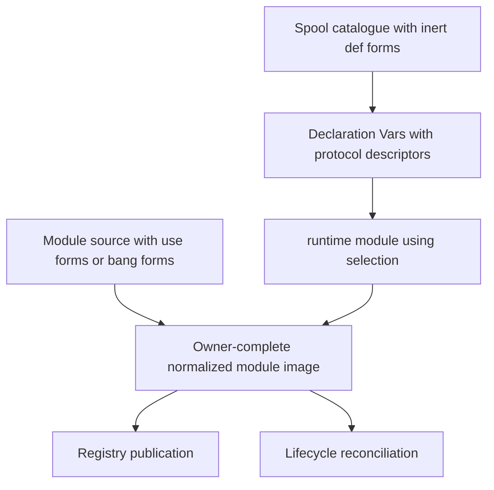
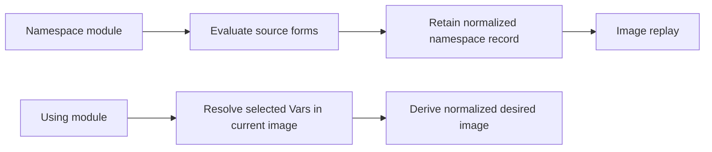

# Select reusable declarations with `runtime/module! :using`

**Document ID:** `RFC-Rmu-001` **Status:** Parked after spike **Date:** 2026-08-14 **Related:** [RFC-Saf-001: replace `:contribute` with authoring forms](2026-07-28-spool-authoring-forms.md), [ADR-003: spool activation lifecycle](../adrs/0003-spool-activation-lifecycle.md), [writing shared spools](../../docs/spools/writing-shared-spools.md), [runtime customisation](../../docs/spools/customisation.md)

## RFC-Rmu-001.P1 Summary

Add a data-first `:using` source target to `millstrand.api.runtime.alpha/module!`. It selects inert authoring declaration Vars without requiring the consumer to create an adapter namespace whose only job is to call one or more `use-*!` forms.

The proposed surface is a non-empty collection of fully qualified declaration Var symbols:

```clojure
(runtime/module!
  runtime
  :acme/reporting
  {:using
   ['acme.reporting.catalogue/create-report
    'acme.reporting.catalogue/overdue-reports
    'acme.reporting.catalogue/report-worker]
   :spools ['acme.spools/reporting]})
```

The selected Vars may belong to different authoring families, channels, namespaces, and approved roots. Their protocol-1 authoring descriptors already identify whether they contribute registry entries or lifecycle effects. The module key remains the owner of the complete selected set.

`:using` is the library form of writing `def*!` declarations in a module source. The declaration is authored once with an inert `def*` form, then a consumer chooses which Vars to activate. Selecting an inert Var through `:using` must produce the same normalized declaration as selecting it with the matching `use-*!` form.

This RFC records a working spike and the decisions made while discussing it. It does not declare the spike production-ready. The branch is parked for later design and implementation work.

## RFC-Rmu-001.P2 Brief

Reusable spools sometimes publish a catalogue of declarations but leave activation to each workspace. Today a consumer writes a module source solely to select those Vars:

```clojure
(ns ct.adapters.workflow
  (:require [millhouse.spools.workflow.cli :as workflow-cli]
            [millstrand.api.millstrand.alpha :as millstrand]))

(millstrand/use-op! workflow-cli/workflow)
```

The workspace then points `runtime/module!` at that adapter file or namespace. This is correct but ceremonial when the adapter contains no behavior or policy beyond a short selection list.

The initial request described the desired case as:

> “the large use case where you just want the module and a little activation config”

The first sketch proposed a callback:

```clojure
(runtime/module! runtime :millhouse/spools-workflow
  {:ns 'millhouse.spools.workflow.cli
   :spools ['millhouse.spools/workflow]}
  :using (fn [workflow-cli]
           (millstrand/use-op! workflow-cli/workflow)))
```

A callback is the wrong boundary. `runtime/module!` deliberately carries activation data rather than entry-point functions. Startup collection also stages module declarations before module source evaluation, so a `use-*!` call beside `module!` would run outside contribution collection and publish nothing.

The discussion converged on a closed data shape instead:

```clojure
{:using
 ['qualified.namespace/declaration
  'another.namespace/declaration]}
```

The descriptor on each selected Var supplies the information that a callback or family-keyed map would otherwise repeat.

## RFC-Rmu-001.P3 Mental model

An authoring family defines three related forms:

```text
defthing       define an inert declaration Var
defthing!      define and select one declaration in module source
use-thing!     select existing declaration Vars in module source
```

`:using` adds a fourth calling surface over the same declaration protocol:

```text
runtime/module! :using
               select existing declaration Vars as activation data
```

It does not add another publication model.



The equivalence is:

```clojure
;; Source-owned definition and selection.
(millstrand/defop! create-report ...)

;; Library definition.
(millstrand/defop create-report ...)

;; Consumer selection in module source.
(millstrand/use-op! catalogue/create-report)

;; Consumer selection in startup activation data.
{:using ['catalogue/create-report]}
```

The last three forms share the same declaration Var. The consumer module owns publication; the catalogue namespace owns the reusable definition.

## RFC-Rmu-001.P4 Proposed grammar

`:using` is one of three mutually exclusive module source targets:

```clojure
{:ns 'acme.module}
{:file "acme/module.clj"}
{:using ['acme.catalogue/one 'acme.catalogue/two]}
```

A declaration must name exactly one of `:ns`, `:file`, or `:using`.

The `:using` value must be:

- a non-empty collection;
- composed only of fully qualified symbols;
- resolved through the runtime spool classloader;
- composed only of Vars carrying valid authoring descriptors.

It composes with the existing world-policy keys:

```clojure
(runtime/module!
  runtime
  :ct/workflow-client
  {:using
   ['millhouse.workflows.catalogue/land
    'millhouse.workflows.catalogue/release]
   :spools
   ['millhouse.spools/workflow
    'millhouse.spools/workflow-catalogue]
   :after [:millhouse/spools-workflow]
   :required? true})
```

`:load :image` is incompatible with `:using`. Selection already resolves declaration Vars from the current Weaver image and has no source-loading callback to bypass.

## RFC-Rmu-001.P5 Selecting several forms

### RFC-Rmu-001.P5.1 Several authoring families from one spool

A spool may expose an op, query, and lifecycle resource as inert declarations:

```clojure
(ns acme.reporting.catalogue
  (:require [millstrand.api.lifecycle.alpha :as lifecycle]
            [millstrand.api.millstrand.alpha :as millstrand]))

(millstrand/defop create-report
  "Create a report."
  {:arg-spec create-report-arg-spec}
  [ctx]
  (create-report! ctx))

(millstrand/defquery overdue-reports
  "Return overdue reports."
  {}
  [:= [:attr :report/state] "overdue"])

(lifecycle/defresource report-worker
  "Own the report worker for the module lifetime."
  {:open 'acme.reporting.runtime/open-worker
   :close 'acme.reporting.runtime/close-worker!})
```

The consumer may activate all three in one module:

```clojure
(runtime/module!
  runtime
  :acme/reporting
  {:using
   ['acme.reporting.catalogue/create-report
    'acme.reporting.catalogue/overdue-reports
    'acme.reporting.catalogue/report-worker]
   :spools ['acme.spools/reporting]})
```

The runtime reads each descriptor and derives one owner-complete image:

```clojure
{:contribution
 {:ops
  {:entries {"create-report" ...}
   :overrides #{}}
  :queries
  {:entries {"overdue-reports" ...}
   :overrides #{}}}

 :lifecycle
 {:report-worker
  {:kind :resource
   :open acme.reporting.runtime/open-worker
   :close acme.reporting.runtime/close-worker!
   :after #{}
   :scope :module}}}
```

### RFC-Rmu-001.P5.2 Declarations from several spools

One module may select Vars from several approved roots:

```clojure
(runtime/module!
  runtime
  :ct/agent-workflow-surface
  {:using
   ['millhouse.spools.workflow.cli/workflow
    'acme.agent.catalogue/delegate
    'acme.agent.catalogue/reviewer-pool]
   :spools
   ['millhouse.spools/workflow
    'acme.spools/agent]
   :after
   [:millhouse/spools-workflow
    :acme/spools-agent]})
```

Every root needed to resolve selected Vars belongs in `:spools`. Every provider module that must establish an open registry kind before selected entries publish belongs in `:after`.

Use one module when the selections are one activation choice and should be refreshed or removed together. Use several modules when they need separate ownership, ordering, or lifecycle removal:

```clojure
(runtime/module!
  runtime
  :ct/workflow-cli
  {:using ['millhouse.catalogue/workflow-op]
   :spools ['millhouse.spools/workflow]
   :after [:millhouse/spools-workflow]})

(runtime/module!
  runtime
  :ct/workflow-worker
  {:using ['millhouse.catalogue/workflow-resource]
   :spools ['millhouse.spools/workflow]
   :after [:millhouse/spools-workflow]})
```

Removing `:ct/workflow-cli` does not close the resource owned by `:ct/workflow-worker`.

## RFC-Rmu-001.P6 Resolution and normalization

Each declaration Var carries metadata shaped by `millstrand.api.authoring.alpha`:

```clojure
{:protocol 1
 :family :millstrand.api.millstrand.alpha/op
 :channel :registry
 :kind :ops
 :key "create-report"
 :entry {...}
 :var acme.reporting.catalogue/create-report}
```

Lifecycle descriptors use `:channel :lifecycle`; open third-party registry families use their own qualified `:family` and `:kind` values.

Evaluation should follow this sequence:

```text
for every selected symbol
  resolve Var through spool classloader
  validate protocol descriptor
  verify descriptor Var identity
  retain declaration and source provenance

reject duplicate effective identities
split registry and lifecycle channels
normalize owner-complete contribution
validate lifecycle set
continue through existing publication and reconciliation
```

Registry duplicate identity is `[kind key]`. Lifecycle duplicate identity is the effect key because one module cannot own two lifecycle effects with the same id, even if their kinds differ.

The coordinator should not implement descriptor protocol checks itself. The spike does that only to establish feasibility.

## RFC-Rmu-001.P7 Shared authoring validation

The production design should refactor descriptor resolution and validation behind one authoring seam. The typed `use-*!` forms and `runtime/module! :using` must call the same logic so they cannot drift.

One possible split is:

```clojure
(authoring/resolve-declarations! resolver symbols)
;; => validated descriptor rows with source provenance

(authoring/normalize-selections declarations)
;; => {:contribution ... :lifecycle ...}
```

The authoring layer owns:

- Var existence and identity validation;
- protocol version and descriptor shape;
- registry versus lifecycle channel validation;
- family, kind, key, and entry validation;
- duplicate effective identity checks;
- normalization into contribution and lifecycle data.

The refresh coordinator owns:

- the spool-classloader-aware resolver;
- root prerequisites and module ordering;
- owner-complete staging and failure retention;
- publication and lifecycle reconciliation;
- result and provenance reporting.

Whether the common functions are public Vars in `millstrand.api.authoring.alpha` or shared internals remains an implementation decision. If `:using` becomes supported alpha API, a public data-first validator is reasonable because it becomes the explicit contract shared by built-in and third-party selection surfaces.

## RFC-Rmu-001.P8 Source identity and provenance

A `:using` module is not source-less. It is a multi-source declaration module. Its source facts are the selected inert `def*` Vars.

This follows the user’s final framing:

> “can `:using` source claim its the def* location? i.e its the library form of just doing `def*!` but you get to select which you choose”

Yes. The module should claim each selected Var’s authored location rather than inventing a synthetic module namespace.

A result projection could be:

```clojure
{:module/key :acme/reporting
 :declaration/source :selected-vars
 :source/status :resolved
 :module/sources
 [{:symbol acme.reporting.catalogue/create-report
   :namespace acme.reporting.catalogue
   :file "/resolved/acme/reporting/catalogue.clj"
   :line 18}
  {:symbol acme.reporting.catalogue/report-worker
   :namespace acme.reporting.catalogue
   :file "/resolved/acme/reporting/catalogue.clj"
   :line 34}]}
```

The exact public keys need specification work. The required semantics are:

- the module key is the owner identity;
- the selected declaration Vars are its source set;
- source provenance is plural even when every Var comes from one namespace;
- each failure identifies the module key and selected symbol;
- no synthetic namespace is exposed;
- Var source metadata is diagnostic provenance, not an independent reload detector.

The spike currently reports `:source/status :using`, `:declaration/source :using`, and `:module/namespace nil`. That was enough to test the path but should not become the final contract without revision. `:using` describes source type, not resolution outcome. Separating `:declaration/source :selected-vars` from `:source/status :resolved` is clearer.

## RFC-Rmu-001.P9 Image behavior

Namespace and file modules evaluate authoring forms during source collection. After successful publication, the coordinator retains their normalized declaration record against the module namespace. `:load :image` can replay that record without loading source or rerunning macros.

A `:using` module already declares a replay recipe as data: its symbol collection. On each evaluation it resolves those Vars from the current spool classloader and reads their current validated descriptors.



`:using` should not read or write namespace declaration records. Caching a second normalized record would create two authorities: the current symbol list and a stale prior resolution.

The required behavior is:

- every evaluation resolves the declared symbols against the current Weaver image;
- a missing Var or invalid descriptor fails loudly;
- failed evaluation retains the previous active module contribution;
- there is no stale-record fallback;
- a new Weaver generation resolves the same declared symbols from the newly loaded roots;
- `:load :image` with `:using` is rejected.

This remains compatible with the generation model. Root synchronization decides which code is available in the generation; `:using` derives desired declarations from that image. Var locations explain where those declarations came from but do not bypass synchronization rules.

## RFC-Rmu-001.P10 Third-party authoring forms

The mechanism is generic across authoring families when the third-party macro uses Millstrand’s selectable authoring protocol. A domain spool should build the family with `millstrand.api.authoring.alpha/defauthoring`, producing inert, typed-use, and bang forms such as:

```text
defworkflow
use-workflow!
defworkflow!
```

Then a consumer may write:

```clojure
(runtime/module!
  runtime
  :ct/workflows
  {:using
   ['millhouse.workflows.catalogue/land
    'millhouse.workflows.catalogue/release]
   :spools
   ['millhouse.spools/workflow
    'millhouse.spools/workflow-catalogue]
   :after [:millhouse/spools-workflow]})
```

The provider module must establish the workflow registry kind before the consumer publishes selected workflows. This is an ordering requirement, not a special case in `:using`.

Current Millhouse `defworkflow` does not qualify. It defines the Var and calls `runtime/collect-entry!` directly, so the Var has no protocol-1 authoring descriptor. Millhouse must first refactor `defworkflow` through `defauthoring` and expose inert definitions. This RFC does not make undocumented ordinary Vars selectable.

## RFC-Rmu-001.P11 Override intent

The flat collection deliberately has no ergonomic representation for `:override?`:

```clojure
{:using ['acme.catalogue/help]}
```

This is accepted scope, not an unresolved blocker. The user ruled:

> “`:override` is always available from the `use-*!` forms so we don't need the ergonomic api we're discussing here to carry every use case”

A consumer that needs deliberate registry shadowing should use a module source and the typed selection form:

```clojure
(millstrand/use-op! {:override? true} catalogue/help)
```

`:using` serves the large, simple selection case. It does not need parity with every typed form option.

## RFC-Rmu-001.P12 Batteries help-transform proving case

The repository’s `.millstrand/ct/adapters/help.clj` was chosen as the first proving case. The file existed only to elect Batteries’ exported help transform as a lifecycle resource.

The spike moved that lifecycle declaration into Batteries as an inert resource:

```clojure
(lifecycle/defresource batteries-help-transform
  "Own a consumer's explicit Batteries help-transform election."
  {:open 'millstrand.spools.batteries/register-help-transform
   :close 'millstrand.spools.batteries/unregister-help-transform!})
```

The canonical workspace could then select it directly:

```clojure
(runtime/module!
  runtime
  :millstrand/batteries-help
  {:using
   ['millstrand.spools.batteries/batteries-help-transform]
   :spools ['millstrand.spools/batteries]
   :after [:millstrand/spools-batteries]})
```

The help election remains a separate module from the Batteries op module. The base module publishes the ordinary Batteries surface; the selection module records this workspace’s optional help-transform election. Their separate module keys preserve separate ownership and removal.

## RFC-Rmu-001.P13 Spike implementation and evidence

The spike lives on branch `spike/module-using` in worktree `/Users/ct/dev/projects/skein-src__spike--module-using`.

Commits:

- `d05efa9a` — `feat(runtime): spike data-first module selection`
- `1472155f` — `refactor(runtime): infer using declaration kinds`

The second commit changed the first resource-keyed grammar into the final flat symbol collection and proved mixed registry and lifecycle selection in one module.

Focused validation passed:

```text
88 tests
710 assertions
0 failures
0 errors
make lint: clean
```

A disposable real Weaver test also covered behavior that the first focused test did not:

```text
start Weaver
  -> Batteries module loads
  -> using module resolves resource
  -> plain strand help renders friendly text
  -> strand help --json returns canonical envelope

full runtime refresh
  -> using resource is preserved
  -> refresh is unchanged

remove using module from init and refresh
  -> resource closes
  -> result reports {:unregistered :help-transform}
  -> plain help returns to raw JSON

restore using module and refresh
  -> resource opens
  -> friendly help returns

stop and start Weaver
  -> new generation resolves selection
  -> friendly help remains active
```

The disposable Weaver, supervisor, workspace, and state were stopped and removed after the test.

## RFC-Rmu-001.P14 Goals

- **RFC-Rmu-001.G1:** Remove ceremonial consumer adapter files whose only behavior is typed declaration selection.
- **RFC-Rmu-001.G2:** Keep module activation data-first; accept no callback or arbitrary form evaluation in `runtime/module!`.
- **RFC-Rmu-001.G3:** Reuse the authoring descriptor and owner-complete publication models rather than add a parallel registration path.
- **RFC-Rmu-001.G4:** Select several declarations from one or several spools in one module.
- **RFC-Rmu-001.G5:** Support core and third-party authoring families through one protocol.
- **RFC-Rmu-001.G6:** Preserve loud failure, module ordering, root approval, omission removal, lifecycle cleanup, and generation behavior.
- **RFC-Rmu-001.G7:** Report selected `def*` locations as the module’s source provenance.

## RFC-Rmu-001.P15 Non-goals

- **RFC-Rmu-001.NG1:** `:using` does not accept callbacks, quoted forms, or arbitrary expressions.
- **RFC-Rmu-001.NG2:** `:using` does not replace typed `use-*!` forms in ordinary module source.
- **RFC-Rmu-001.NG3:** The flat grammar does not carry `:override?`; use a typed selection form when override intent is required.
- **RFC-Rmu-001.NG4:** `:using` does not make ordinary Vars or legacy direct `collect-entry!` macros selectable.
- **RFC-Rmu-001.NG5:** `:using` does not establish open registry kinds. Provider modules retain that responsibility.
- **RFC-Rmu-001.NG6:** This RFC does not choose final result key names for plural source provenance.
- **RFC-Rmu-001.NG7:** This capture does not land the spike implementation or amend root specs.

## RFC-Rmu-001.P16 Failure behavior

| Condition | Required outcome |
| --- | --- |
| Empty `:using` collection | Declaration fails |
| Unqualified selection symbol | Declaration fails |
| More than one of `:ns`, `:file`, and `:using` | Declaration fails |
| Selected Var cannot resolve | Module evaluation fails with module key and symbol |
| Selected Var lacks a valid descriptor | Module evaluation fails with module key and symbol |
| Descriptor Var identity differs from selected symbol | Module evaluation fails |
| Duplicate registry kind/key | Module evaluation fails before publication |
| Duplicate lifecycle effect key | Module evaluation fails before reconciliation |
| Registry kind has not been declared | Existing publication validation fails |
| Required root is unavailable | Existing required-module policy applies |
| Selection evaluation fails after prior success | Prior active contribution and resources remain retained |
| `:load :image` accompanies `:using` | Declaration fails |

## RFC-Rmu-001.P17 Recommended follow-up

1. Extract descriptor resolution, validation, duplicate detection, and normalization into the shared authoring layer.
2. Make generated typed `use-*!` forms and `runtime/module! :using` call that shared seam.
3. Specify plural source provenance using selected Var symbols and their authored locations.
4. Add focused tests for mixed built-in families, omission/removal, failure retention, duplicate identities, and a generated third-party `defauthoring` family.
5. Refactor a Millhouse family, preferably Workflow, onto `defauthoring`; prove a real external `defworkflow` catalogue selection after its provider module declares the kind.
6. Decide whether Batteries should permanently expose the inert help resource and whether the repository adapter should be removed as part of the production feature.
7. Promote accepted behavior into the Weaver Runtime and REPL API root specs, then update authoring and customisation docs.

The production change should be planned as feature work. The two spike commits are evidence and implementation notes, not a merge recommendation.

## RFC-Rmu-001.P18 Related strands and session artifacts

All critical decisions and evidence are recorded above. These references carry supplementary notes and exact run context:

- Kanban card `mf21o` — **Spike runtime module using declarations**
- Task `uarrn` — **Prototype `:using` with Batteries help resource**
- Task `sw1fi` — **Generalize `:using` to descriptor Vars**
- Explore workflow run `module-using-spike`
- Explore workflow root `2xsa9`
- Human fate checkpoint `pau4h`
- Trail step `36qnm`
- Explore step `pqex7`
- Real-Weaver evidence note `uj4px`
- Flat-selection summary note `d5azj`
- Pi session `01a001ba-cb79-7968-b05c-cc44f21c856a`

The stable dialogue capture for that Pi session was consulted while preparing this RFC so the brief, rulings, and quoted phrasing above match the discussion.

## RFC-Rmu-001.P19 Outcome

Parked after a successful feasibility spike.

The working recommendation is the flat `:using` collection of qualified inert declaration Vars, generic descriptor-driven dispatch, selected-Var source provenance, direct current-image resolution, and no override syntax. Resume by promoting the explore thread into feature planning or revising this RFC after a cold review.
